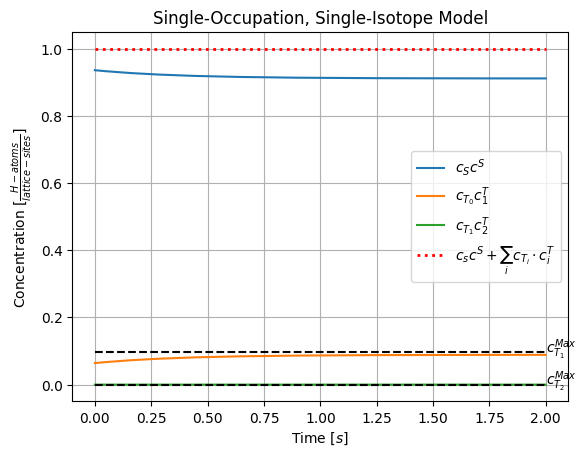
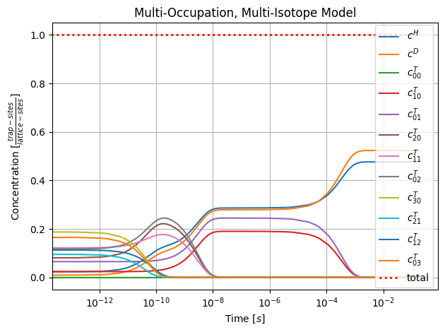
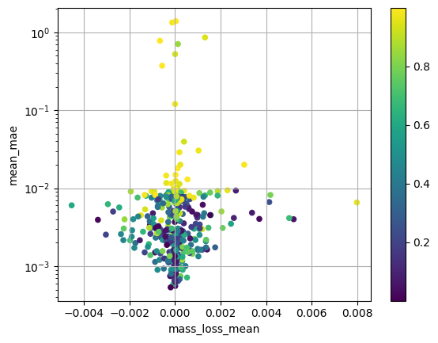
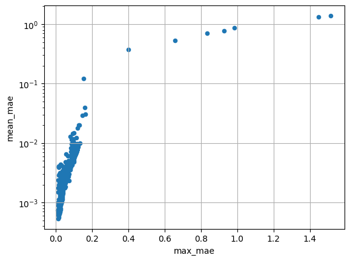
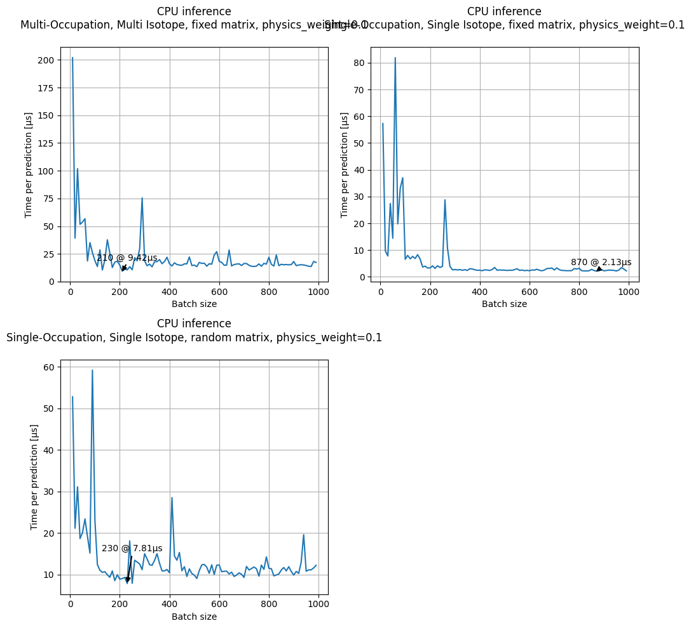
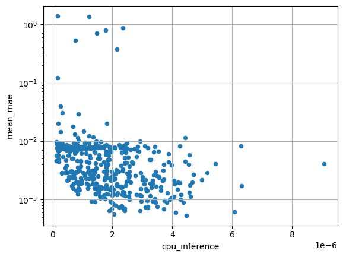

# Surrogate Solver for Trap Diffusion

## Intro

In the Tokamak fusion reactor of the Max Planck Institute for Plasma Physics (IPP), various hydrogen isotopes are brought to nuclear fusion at temperatures exceeding 100 million degrees Celsius. Since no solid material can withstand this temperature, the resulting plasma is confined within a magnetic field. However, this confinement is not perfect:

The neutrons generated during the fusion reaction cannot be deflected by magnetic fields and must be captured by the wall of the vacuum vessel. This wall needs active cooling to withstand the high energy flux, and materials like tungsten and its alloys are suitable for this purpose.

However, even tungsten develops defects in the metal lattice under strong neutron radiation. With the help of these defects (hydrogen traps), hydrogen can diffuse into the reactor's wall, and is consequently no longer involved in the fusion. This is particularly undesirable for the expensive and radioactive hydrogen isotope tritium.

To better understand this diffusion process, one can simulate the behavior of different hydrogen isotopes in contact with the wall. Operator splitting allows the independent calculation of global and local effects: Each simulation step calculates the diffusion of hydrogen in and out of each trap independently, then advances the untrapped (solute) hydrogen in a global simulation step. 

The vector Riccati (differential) equation describing the behavior of an individual defect is numerically expensive to solve, significantly slowing down the simulation to the point where macroscopic simulations are not practical, even on the current IPP supercomputer, Raven.

The goal of the project is to develop a fast surrogate solver for the differential equation of individual defects. For this purpose, a Physics Informed Neural Network (PINN) will be employed. An Artificial Neural Network (ANN) can approximate any function, and PINNs, compared to classical neural networks, have the advantage of integrating physical knowledge about the system, such as conservation laws, into the training process.

Initially, training data is generated through classical numerical methods. After successfully training the network, it needs to be optimized and specifically implemented for use on the CPUs of Raven.

## Physical Model
> TODO rewrite this, single occupation means something different

The diffusion of hydrogen in a tungsten lattice defect has been described in various ways, but the only model to predict all measured effects so far is also the most involved:
Each defect can trap multiple hydrogen atoms in different states, and each of these atoms can be one of the three main hydrogen isotopes:
> TODO this is also wrong, only modeling h and d?? what
- Protium (H)
- Deuterium (D)
- Tritium (T)

The hydrogen atoms can transition to another state inside the trap, or leave the trap entirely. The capture and release in and out of the trap can be modeled the same way as the transitioning between the states by including a solute state in the equations.

The trap states can be saturated so that no more hydrogen can be captured.

### Single-Occupation, Single-Isotope

### Multi-Occupation, Multi-Isotope

The timescales in the full model are what makes it so difficult to solve. The PDE is incredibly stiff, covering 14 oders of magnitude in time.

> TODO redo this plot with all physical values
At first, the highly occupied states lose one hydrogen atom in the order of $10^{-10}s$, the two hydrogen states decay in $10^{-8}s$. The single hydrogen states go into solution after about $10^{-3}s$

## PINN Requirements

1. Total concentration of hydrogen in the system is conserved. Even a small systematic error here will lead to wrong results as the error accumulates exponentially over timesteps.
2. The PINN must predict the solutions to about ~1% error
3. The PINN must be able to make a prediction in <50µs on a CPU

## PINN Architecture

The extremly tight time constraints and the exection on CPU require a very small network, smaller than what is considered small in most literature. The simplest approach is to use a tiny fully connected network.

However, having such a small network also enables thorough random hyperparameter searches to find the best network architecture.

For even more efficient search, the architectures are first tested on the Single-Occupation, Single-Isotope model before the learnings are applied to the slightly more complex Multi-Occupation, Multi-Isotope model.

### General Architecture

As the requirement for accuracy is given directly as a maxmimum deviation, mean average error (mae) is the first choice as loss function.

The network gets initial concentrations as well as a normalized time as input, and outputs the concentrations at that time.

#### Activations

##### Output Activation

As all outputs are concentrations, the ouputs should be positive. There is no bias towards any particular value, so the functions like sigmoid don't make sense, as they would require large ouptut activations to get close to zero or one.

A more natural choice is the ReLU activation, which limits the output to positive values.

Unexpectedly this leads to unstable training. The network seems to introduce large negative bias to the last layer, which initially improves the loss as some concentrations are close to zero. However, if the ReLUs only output zeros, the gradients are also zero, and the network is stuck at a local minimum.
> TODO add reference to ReLUs dying

The two blue bands in the image correspond to two concentraitions close to zero. Altough some networks with ReLU activations lead to good results, leaky relu  or no (linear) activation functions lead to more stable training.

The third band at a loss of $10^{-2}$ seems to be equally difficult, but not as impossible to overcome for all activation functions

### Fulfilling Requirement 1: Mass Conservation

#### Approach 1:

Force the network to learn the mass conservation by adding a penalty term to the loss function. This is now called "physics loss". The total loss now consists of the mean squared error (MSE) and the physics loss:

$$
\mathcal{L} = (1-\lambda)\mathcal{L}_{MSE} + \lambda\mathcal{L}_{physics}
$$
where $\lambda$ is the physics weight.

Extensive search over different model sizes, architectures and physics weights has shown that this approach is not feasible. The network is unable to learn the mass conservation, and mae is generally much higher for networks with high physics weights.
> TODO better axis labels

#### Approach 2:

Renormalize the output of the network to always have perfect mass conservation. This works in principle, but the accuracy goes down as there is no penalty on large outputs, so the network weights can grow arbitrarily large which in turn increases uncertainty in the predictions.
> TODO get picture off of raven

> TODO add normal loss to model before renormalization
> TODO increase regularization

### Fulfilling Requirement 2: Accuracy

Training on only the maximum error is infeasable, as the network would only get one weight update per epoch. Luckily the mean average error (mae) is a good proxy for the maximum error, and can be used as a loss function.

> TODO better plot, maybe double logarithm

### Fulfilling Requirement 3: Speed

The final CPU speed is dependent on the implementation of the specific architecture.
Using a numpy implementation in python has large overhead for small matrices, but increasing the batch size gets it close to the underlying BLAS performance. That performance can also be achieved for a batch size of one by implementing the chosen network architecture in e.g. C++ and compiling it. 

> TODO Implement Current best model for CPU

The above graph gives a minimum batchsize for approximating performance during hyperparameter search without implementing a compiled C++ version of each model.

The inference time does not seem to be the limiting factor for accuracy, as increasing model size (and inference time) does not lead to generally better results after about 2µs for the SOSI fixed model.

## Data Generation

> TODO train with realistic params

> TODO find relevant initial concentrations, random at the moment

The training data is generated by solving the given system of equations for multiple initial configurations using a numerical solver with adaptive step size.  
A single data point is a pair of concentrations and a time for the prediction, so each simulation leads to $\mathcal{O}(100)$ training data points. Each dataset contains multiple simulations, depending on the case also varying the transition matrices and including them in the training input.

> TODO insert dataset info

> TODO make more clear

> TODO redo this table in latex, this sucks in markdown

> TODO MOMI random

Method |Short name| training input|training output|
--|--|--|--
single occupation, single isotope, fixed matrix|SOSI fixed| <ul><li>time (normalized to 0-1)</li><li>hydrogen concentrations</li></ul>| hydrogen concentrations, normalization constants (i.e. trap concentrations)|
single occupation, single isotope, random matrix| SOSI random| <ul><li>time (normalized to 0-1)</li><li>hydrogen concentrations</li><li>non-redundant transition matrix elements (TODO explicitly list)</li></ul> | hydrogen concentrations, normalization constants (i.e. trap concentrations, now dependent on the matrix)
Multi occupation, multi isotope, fixed matrix | MOMI fixed|<ul><li>log(time) (normalized to $\sim0-1$)</li><li>hydrogen concentrations</li></ul>| hydrogen concentrations, normalization constants (i.e occupations)
single occupation, single isotope, fixed matrix, normalized outputs|SOSI fixed normalized| <ul><li>time (normalized to 0-1)</li><li>hydrogen concentrations</li></ul>| hydrogen concentrations, normalization constants (i.e. trap concentrations)|
single occupation, single isotope, random matrix normlized outputs| SOSI random normlized| <ul><li>time (normalized to 0-1)</li><li>normalized hydrogen concentrations (i.e. total concentration, not trap concentration)</li><li>non-redundant transition matrix elements (TODO explicitly list)</li></ul> | normalized hydrogen concentrations
Multi occupation, multi isotope, fixed matrix, normalized outputs | MOMI fixed normalized|<ul><li>log(time) (normalized to $\sim0-1$)</li><li>hydrogen concentrations</li></ul>| hydrogen concentrations

To keep the training code simpler, the normalization constants are always added to each datapoint, even when they are constant within the whole dataset.

## Random Search

> TODO describe